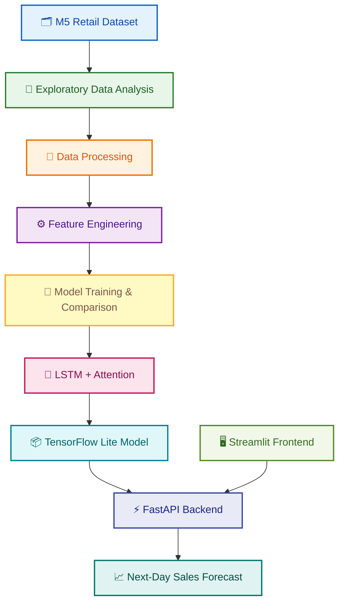

<div align="center">

# 🛒 Retail Sales Forecasting System

### An End-to-End Deep Learning Project for Next-Day Retail Sales Prediction

Predict the next day's product sales using historical retail data,  
LSTM with Attention, FastAPI, and Streamlit.

<br>

[](https://www.python.org/)
[](https://www.tensorflow.org/)
[](https://fastapi.tiangolo.com/)
[](https://streamlit.io/)
[](https://www.docker.com/)
[](https://render.com/)

<br>

<a href="https://m5-sales-forecasting-frontend.onrender.com">
  
</a>

<a href="https://m5-sales-forecasting-api.onrender.com/docs">
  
</a>

</div>

---

## 📌 Project Overview

Retail businesses need to estimate future product demand to make
better decisions about inventory, replenishment, and stock availability.

This project is an **end-to-end retail sales forecasting system** built
using the Walmart M5 Forecasting dataset.

It uses historical sales data and engineered time-series features to
predict the next day's sales for a selected product at a particular store.

The system combines:

- **Data Analysis:** Understand historical sales patterns.
- **Feature Engineering:** Generate lag, rolling, and other time-series features.
- **Deep Learning:** Use an LSTM model with an Attention mechanism.
- **Model Optimization:** Convert the trained model to TensorFlow Lite.
- **Backend:** Serve predictions through a FastAPI application.
- **Frontend:** Allow users to request forecasts through a Streamlit interface.
- **Deployment:** Deploy the application using Docker and Render.

The goal is to turn historical retail data into an interactive forecasting
application that can be used through a simple web interface.

---

## 🛍️ Why Retail Sales Forecasting?


Retail sales change over time due to several factors, including:

- Day-of-week and seasonal patterns
- Product-level demand
- Store-level differences
- Promotions and pricing
- Holidays and special events
- Changes in customer purchasing behaviour

Forecasting future sales can help businesses plan inventory and reduce
the risk of overstocking or running out of products.

This project focuses on predicting **next-day sales** for a given
item-store combination.

---

## 🎯 Project Objective

Given an `Item ID` and a `Store ID`, the system predicts the expected
sales for the next day.

### Input

```text
Item ID: FOODS_1_001
Store ID: CA_1
```

### Processing

```text
Historical Sales
      +
Time-Series Features
      +
LSTM with Attention
```

### Output

```text
Forecast Date: 2016-04-25
Predicted Sales: approximately 1.15 units
```

The value is a model prediction and may be fractional. It represents
the forecast produced by the trained model, not a confirmed actual sale.

---

## 🌐 Live Demo

Try the deployed application:

| Component | Link |
|---|---|
| 🖥️ Streamlit Frontend | [Open Live Application](https://m5-sales-forecasting-frontend.onrender.com) |
| ⚡ FastAPI Backend | [Open API Service](https://m5-sales-forecasting-api.onrender.com) |
| 📘 Swagger API Documentation | [Explore API Docs](https://m5-sales-forecasting-api.onrender.com/docs) |
| 💻 GitHub Repository | [View Source Code](https://github.com/Goutam14226/Retail-Sales-Forecasting-System) |

### How to use the application

1. Open the Streamlit application.
2. Enter a valid **Item ID**.
3. Enter a valid **Store ID**.
4. Submit the forecast request.
5. View the predicted next-day sales.

The frontend sends the request to the FastAPI backend, which processes
the input and returns the model prediction.

> Note: The hosted application may take some time to respond if the
> service is waking up from an idle state.

---

## 🧠 System Architecture

The project follows a complete machine learning workflow, from raw
data processing to a deployed forecasting application.



### Workflow explained

| Stage | Description |
|---|---|
| 1. Dataset | Load the M5 retail sales, calendar, and price data. |
| 2. EDA | Understand sales distributions, zero-sales observations, and trends. |
| 3. Processing | Prepare the data in a format suitable for time-series modeling. |
| 4. Feature Engineering | Generate historical lag, rolling, and other useful features. |
| 5. Model Experiments | Train and compare multiple forecasting architectures. |
| 6. Final Model | Use the selected LSTM with Attention model. |
| 7. Optimization | Convert the trained model for lightweight inference. |
| 8. API | Receive forecasting requests and return predictions. |
| 9. Frontend | Let users enter product and store identifiers. |
| 10. Forecast | Display the predicted next-day sales. |

---

## 📊 Dataset

This project uses the **Walmart M5 Forecasting dataset**, a retail
time-series dataset containing daily sales observations for products
across multiple stores.

The dataset includes information about:

- Product and store identifiers
- Historical daily unit sales
- Calendar dates and events
- Product prices across stores
- Product categories and departments

### Main dataset files

| File | Purpose |
|---|---|
| `sales_train_validation.csv` | Historical sales data for training and validation. |
| `sales_train_evaluation.csv` | Sales data with the evaluation period. |
| `calendar.csv` | Dates, weekdays, events, and calendar-related information. |
| `sell_prices.csv` | Product prices by store and week. |
| `sample_submission.csv` | Example format for M5 competition submissions. |

The original M5 dataset is available from Kaggle:

👉 [Walmart Recruiting – M5 Forecasting](https://www.kaggle.com/competitions/m5-forecasting-accuracy/data)

**Important:** The original dataset is large. The raw CSV files are not
required to run the already-deployed live demo.

---

## 🔬 Exploratory Data Analysis

Before training the models, exploratory data analysis was performed
to understand the structure and behaviour of the retail data.

The analysis focused on:

- Dataset dimensions and data types
- Product, store, department, and category distributions
- Daily sales trends
- Zero-sales observations
- Sales distributions and outliers
- Calendar and price information
- Patterns relevant to time-series forecasting

### Key observation

Retail sales data contains many zero-sales observations. A zero is not
necessarily missing data; it can mean that a product did not sell on
that particular day.

Therefore, zero-sales observations need to be interpreted carefully
rather than automatically removed or replaced.

---

## ⚙️ Feature Engineering

Historical sales values are transformed into features that help the
model learn patterns over time.

The forecasting pipeline uses a **28-day historical input window**
to predict sales for the following day.

Conceptually:

```text
Previous 28 Days
       |
       v
Time-Series Feature Generation
       |
       v
Feature Scaling
       |
       v
LSTM + Attention
       |
       v
Next-Day Forecast
```

The feature engineering process includes:

- Lag-based sales information
- Rolling-window statistics
- Calendar-related information
- Other engineered features used by the final model

The model uses the prepared historical sequence and corresponding
features to generate its forecast.

---

## 🤖 Model Development

Multiple neural-network architectures were explored during the project.

| Model | Description |
|---|---|
| RNN | A recurrent neural network used as a baseline sequence model. |
| LSTM | A recurrent architecture designed to learn sequential patterns. |
| GRU | A gated recurrent architecture for time-series data. |
| LSTM + Attention | An LSTM model enhanced with an Attention mechanism. |
| Transformer | An attention-based architecture explored for forecasting. |

### Final Model: LSTM + Attention

The deployed forecasting pipeline uses an **LSTM with Attention** model.

The LSTM learns patterns from historical sales sequences. The Attention
mechanism helps the model assign different importance to information
within the input sequence.

The final model is used to predict next-day sales for a selected
item-store combination.

### Why LSTM with Attention?

- Learns patterns from sequential data.
- Can use information from multiple previous days.
- Attention can help the model focus on relevant parts of the sequence.
- Supports a compact inference pipeline after model conversion.

---

## 📦 Model Optimization and Inference

The trained model is converted to **TensorFlow Lite** for inference.

The deployed API uses the optimized model to generate predictions
without needing to run the complete training pipeline for every request.

The inference process is:

1. Receive the item and store identifiers.
2. Retrieve the corresponding historical information.
3. Prepare the input features and sequence.
4. Apply the required feature scaling.
5. Run the TensorFlow Lite model.
6. Return the predicted sales and forecast date.

---

## 🧩 Repository Structure

The repository is organized into data, notebooks, configuration,
model artifacts, and deployment components.

```text
Retail-Sales-Forecasting-System/
│
├── README.md
│   └── Project overview, architecture, setup, and usage
│
├── configs/
│   ├── config.py
│   │   └── Main forecasting and feature configuration
│   └── config.json
│       └── JSON configuration, where applicable
│
├── data/
│   ├── calendar.csv
│   │   └── Calendar and event information
│   ├── sales_train_validation.csv
│   │   └── Historical sales data
│   ├── sales_train_evaluation.csv
│   │   └── Sales data including the evaluation period
│   ├── sell_prices.csv
│   │   └── Product pricing information
│   ├── sample_submission.csv
│   │   └── Example submission format
│   ├── features_production.parquet
│   │   └── Prepared production features
│   └── latest_history.parquet
│       └── Historical data used during forecasting
│
├── notebooks/
│   ├── EDA/
│   │   └── Exploratory data analysis
│   │
│   ├── Processing/
│   │   └── Data cleaning and transformation
│   │
│   ├── Feature_Engineering/
│   │   └── Time-series feature creation
│   │
│   ├── Baseline/
│   │   └── Baseline forecasting experiments
│   │
│   ├── RNN/
│   │   └── RNN experiments
│   │
│   ├── LSTM/
│   │   └── LSTM experiments
│   │
│   ├── GRU/
│   │   └── GRU experiments
│   │
│   ├── LSTM_Attention/
│   │   └── LSTM with Attention experiments
│   │
│   ├── Transformer/
│   │   └── Transformer experiments
│   │
│   └── Model_Comparison/
│       └── Comparison of forecasting models
│
├── models/
│   ├── lstm_attention_production.keras
│   │   └── Saved trained model
│   └── feature_scaler.pkl
│       └── Feature scaling object
│
├── reports/
│   └── training_history.csv
│       └── Training history and related records
│
├── src/
│   ├── api/
│   │   └── FastAPI backend and forecasting endpoint
│   │
│   └── frontend/
│       └── Streamlit forecasting interface
│
├── Dockerfile
│   └── Container configuration, where applicable
│
├── requirements.txt
│   └── Python dependencies
│
└── render.yaml
    └── Render deployment configuration, where applicable
```

> **Note:** This is a documentation-oriented overview of the project
> structure. Check the actual repository for the exact filenames and
> which optional artifacts are included in the current GitHub version.
> Large raw datasets and generated files may be excluded from Git.

---

## 🖥️ Application Preview

### 1. Retail Forecasting Interface

Open the deployed application to enter an item and store and request
a sales forecast.

👉 [Launch the Streamlit Application](https://m5-sales-forecasting-frontend.onrender.com)

<!-- Replace this image with a screenshot saved in your repository. -->
<!-- Example:  -->

### 2. API Documentation

The FastAPI backend provides interactive API documentation through
Swagger UI.

👉 [Open Swagger Documentation](https://m5-sales-forecasting-api.onrender.com/docs)

<!-- Replace this image with a screenshot saved in your repository. -->
<!-- Example:  -->

---

## 🔌 API Usage

The forecasting backend exposes a `/forecast` endpoint.

### Endpoint

```http
POST /forecast
```

### Example request

```json
{
  "item_id": "FOODS_1_001",
  "store_id": "CA_1"
}
```

### Example Python request

```python
import requests

url = "https://m5-sales-forecasting-api.onrender.com/forecast"

payload = {
    "item_id": "FOODS_1_001",
    "store_id": "CA_1"
}

response = requests.post(url, json=payload)

print(response.status_code)
print(response.json())
```

### Example response

The deployed API has successfully returned a prediction for this
example input.

```json
{
  "item_id": "FOODS_1_001",
  "store_id": "CA_1",
  "forecast_date": "2016-04-25",
  "predicted_sales": 1.1503628492355347
}
```

The exact response fields should match the current API implementation.
The prediction above is an example from a successful API request.

---

## 🛠️ Tech Stack

| Category | Technology |
|---|---|
| Programming Language | Python |
| Data Analysis | Pandas, NumPy |
| Visualization | Matplotlib |
| Deep Learning | TensorFlow / Keras |
| Sequence Modeling | RNN, LSTM, GRU |
| Attention | LSTM with Attention |
| Model Inference | TensorFlow Lite |
| Backend | FastAPI |
| API Server | Uvicorn |
| Frontend | Streamlit |
| Containerization | Docker |
| Deployment | Render |
| Dataset | Walmart M5 Forecasting |

---

## 🚀 Run the Project Locally

### Prerequisites

Make sure you have:

- Python 3.11
- Git
- pip
- The project repository
- Required model artifacts and data files

### Step 1: Clone the repository

```bash
git clone https://github.com/Goutam14226/Retail-Sales-Forecasting-System.git

cd Retail-Sales-Forecasting-System
```

### Step 2: Create a virtual environment

```bash
python -m venv .venv
```

Activate it.

**Windows:**

```bash
.venv\Scripts\activate
```

**Linux / macOS:**

```bash
source .venv/bin/activate
```

### Step 3: Install dependencies

```bash
pip install -r requirements.txt
```

### Step 4: Configure the application

Check the project's configuration files and environment variables.

If the frontend requires an API URL, configure it to point to the
locally running backend.

Example:

```text
API_URL=http://127.0.0.1:8003/forecast
```

Use the variable name and configuration expected by the actual
frontend implementation.

### Step 5: Start the FastAPI backend

Run the API using the entry point present in the repository.

For example, if the application is exposed as `app` in `src/api/main.py`:

```bash
uvicorn src.api.main:app --host 0.0.0.0 --port 8003 --reload
```

Open the API documentation:

```text
http://localhost:8003/docs
```

### Step 6: Start the Streamlit frontend

Open another terminal, activate the same virtual environment, and
run the frontend entry point.

For example:

```bash
streamlit run src/frontend/app.py
```

Open the local application at:

```text
http://localhost:8501
```

> The commands above assume the corresponding entry-point paths exist.
> If the repository uses different filenames or module paths, use those
> actual paths instead.

---

## 🐳 Docker

Docker can package the application and its dependencies into a
consistent environment.

To build an image using a Dockerfile in the repository root:

```bash
docker build -t retail-sales-forecasting .
```

To run the image:

```bash
docker run --rm -p 8003:8003 retail-sales-forecasting
```

The exact Docker build and run commands depend on which service the
Dockerfile is configured to start.

For a multi-service deployment, configure the API and frontend
according to their respective Docker and environment settings.

---

## 📈 Evaluation and Results

The project includes experiments with multiple forecasting architectures
and a final deployed LSTM with Attention model.

The model development workflow includes:

- Training and validation
- Comparison of candidate architectures
- Preparation of the final model
- Feature scaling and inference preparation
- Conversion to TensorFlow Lite
- Testing through the FastAPI endpoint

A successful API request returned HTTP **200 OK** for the example
item-store input.

### Example prediction

| Field | Value |
|---|---|
| Item ID | `FOODS_1_001` |
| Store ID | `CA_1` |
| Forecast Date | `2016-04-25` |
| Predicted Sales | Approximately `1.15` |

Quantitative model metrics such as MAE, RMSE, or MAPE should be added
here only when the corresponding final evaluation results are available.

---

## 💡 Real-World Applications

The forecasting workflow can support several retail planning tasks.

### 📦 Inventory Planning

Use predicted demand as an input when estimating how much inventory
may be required.

### 🏪 Store-Level Demand Analysis

Compare demand forecasts across different stores and products.

### 🔄 Replenishment Planning

Use forecasts to support decisions about when products may need
replenishment.

### 📊 Business Analytics

Combine sales forecasts with historical sales, pricing, and calendar
information to understand demand patterns.

> This project produces sales forecasts. It does not guarantee that
> inventory decisions based on those forecasts will be optimal.

---

## 🔮 Future Improvements

Possible future extensions include:

- Multi-day sales forecasting
- Forecasting at product, department, and store levels
- Incorporating additional promotion and price signals
- Adding forecast confidence intervals
- Monitoring model performance over time
- Automated model retraining
- Forecast-based inventory optimization
- Improved input validation and API error handling
- More detailed model evaluation dashboards

---

## 👨‍💻 Author

**Goutam Agarwal**

Master's graduate from IIT Bombay, interested in Data Science,
Machine Learning, and AI Engineering.

- GitHub: [Goutam14226](https://github.com/Goutam14226)
- Project: [Retail Sales Forecasting System](https://github.com/Goutam14226/Retail-Sales-Forecasting-System)

---

## ⭐ Support

If you find this project useful or interesting, consider giving the
repository a ⭐ on GitHub.

Thank you for visiting!
